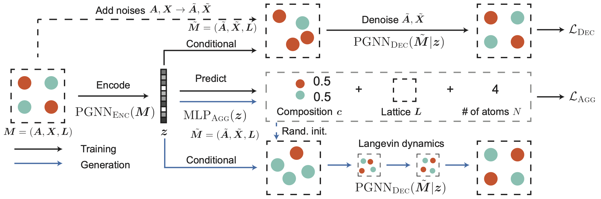

Todo:

1. experiment with DIME Net 
DIRECTIONAL MESSAGE PASSING FOR MOLECULAR GRAPHS
https://arxiv.org/pdf/2003.03123

2. From DIME Net to Crystal Diffusion Variational AutoEncoder (CDVAE) RYSTAL DIFFUSION VARIATIONAL AUTOENCODER FOR PERIODIC MATERIAL GENERATION

