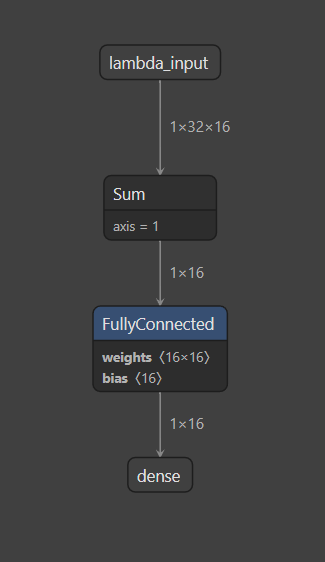

Readme v 1.0 @April Zheng & Adam Zheng 

# Graph neural network based application on  Quantum Chemistry
Inspired from https://arxiv.org/pdf/1704.01212

## DataSet QM9
http://quantum-machine.org/datasets/
https://www.nature.com/articles/sdata201422

QM9 is a dataset of 134,000 molecules consisting of 9 heavy atoms drawn from the elements C, H, O, N, F. The features are the xyz coordinates  and elements of the molecule. The coordinates are determined from B3LYP/6-31G(2df,p) level DFT geometry optimization. There are multiple labels (see table below), including the energy of formation (Enthalpy at 298.15 K).

The labels include:
| Index | Name | Units | Description | 
| ------|------- | ----|--------- |
| 0 | index | - | Consecutive, 1-based integer identifier of molecule |
| 1| A | GHz | Rotational constant A |
| 2| B | GHz | Rotational constant B |
| 3| C | GHz | Rotational constant C |
| 4| mu | Debye | Dipole moment |
| 5| aplha | Bohr^3 | Isotropic polarizability |
| 6| homo | Hartree | Energy of Highest occupied molecular orbital (HOMO) |
| 7| lumo | Hartree | Energy of Lowest unoccupied molecular orbital (LUMO) |
| 8| gap | Hartree | Gap, difference between LUMO and HOMO |
| 9| r2 | Bohr^2 | Electronic spatial extent |
| 10| zpve | Hartree | Zero point vibrational energy |
| 11| Uo | Hartree | Internal energy at 0 K |
| 12| U | Hartree | Internal energy at 298.15 K |
| 13| H | Hartree | Enthalpy at 298.15 K |
| 14| G | Hartree | Free energy at 298.15 K |
| 15| Cv | cal/(mol K) | Heat capacity at 298.15 K |

Following explanatino come from https://arxiv.org/pdf/1704.01212 
"First, we have four properties related to how tightly bound together the atoms in a molecule
are. These measure the energy required to break up the molecule at different temperatures and pressures. These include the atomization energy at 0K, U0 (eV), atomization energy at room temperature, U (eV), enthalpy of atomization at room temperature, H (eV), and free energy of atomization, G (eV).
Next there are properties related to fundamental vibrations of the molecule, including the highest fundamental vibrational frequency ω1 (cm−1) and the zero point vibrational energy (ZPVE) (eV). Additionally, there are a number of properties that concern the states of the electrons in the molecule. They include the energy of the electron in the highest occupied molecular orbital (HOMO) εHOMO (eV), the energy of the lowest unoccupied molecular orbital (LUMO) εLUMO (eV), and the electron energy gap (∆ε (eV)). The electron energy gap is simply the difference εHOMO − εLUMO.
Finally, there are several measures of the spatial distribution of electrons in the molecule. These include the electronic spatial extent hR2 i (Bohr2), the norm of the dipole
moment µ (Debye), and the norm of static polarizability α (Bohr3)."

## Problem statement
To desgin AI Neural network to prdicte QM9 material properites (indicated by label values in above table) based its atoms and corrdinations.


## Neural Network 
### Convolution Neural Network 
This network consists of a fully connected layer. Atom information is encoded using one-hot encoding mechnaism. For materials in QM9, there are maximum 32 atoms of 16 different elements. After encoding, the input is in format of 32x16.
Notes: atom corrdination information is not used.


The model construction is done as following:
```
optimizer = keras.optimizers.RMSprop(learning_rate=0.0001)
def simple_keras_model():
    model = keras.Sequential()
    model.add(keras.layers.Lambda(lambda x: keras.backend.sum(x, axis=1,keepdims=False)))
    model.add(keras.layers.Dense(16, use_bias=True))
    model.compile(loss='mean_squared_error', optimizer = optimizer, metrics=['mae', r2_keras])
    return model
```
The visualization of FC network structure:


Training on 100 epochs:

The MAE(mean absolute eror) curve is shown as following: 


It can be seen at about 50 epoch, the MAE 
is converged to 0.1.

After 100 epoch, the loss/mae/r2 values are as following:

```
Epoch 100/100
157/157 [==============================] - 0s 687us/step - loss: 0.1879 - mae: 0.1002 - r2_keras: 0.8083
```
r2_keras indicates how close the fitted regression line is to ground-truth data. The highest score possible is 1.0. It indicates that the predictors perfectly accounts for variation in the target. A score of 0.0 indicates that the predictors do not account for variation in the target.

The following result(loss/mae/r2) is caluldated on validation dataset which is not in training dataset.

```
[7.412908554077148, 0.10898412764072418, 0.6476361155509949]
```

### Graph Neural Network 
https://arxiv.org/pdf/1609.02907
Graph Neural Network takes input as graph with nodes and edges. From QM9 dataset, atom coordinates are used to calcualte distance between atom which then construct as the edge between nodes(atoms)

GNN is performing information aggregation (from all neighbor nodes and edges to current node), then update current node information. 


```
def simple_gnn_model():
    # nodes: [N, N, node_feature_len]
    # edges: [N, N]
    nodes = keras.Input((32, 32, node_feature_len))
    edges = keras.Input((32, 32))
    features = keras.Input((graph_feature_len))

    # out: [N, N, msg_feature_len]
    out = Conv_block(nodes, msg_feature_len, 'relu')
    # out: = [N, N, msg_feature_len] . [N, N, 1]

    #out = keras.layers.Lambda(lambda x: x[0] * K.expand_dims(x[1], axis=-1))([out, edges])
    x = K.expand_dims(edges, axis=-1)
    x = K.repeat_elements(x, msg_feature_len, axis=-1)
    out = keras.layers.Multiply()([out, x])
    # out: [N, msg_feature_len]
    out = keras.layers.Lambda(lambda x: K.sum(x, axis=2,keepdims=False))(out)
    # new_nodes: [N, node_feature_len]
    new_nodes = Conv_block(out, node_feature_len, 'relu')
    # out: [node_feature_len]
    out = keras.layers.Lambda(lambda x: K.sum(x, axis=1, keepdims=False))(new_nodes)
    # out: [graph_feature_len]
    new_features = keras.layers.Dense(graph_feature_len, use_bias=True)(out)
    new_features = keras.layers.Lambda(lambda x: x[0] + x[1])([new_features, features])
    pred =  keras.layers.Dense(16, use_bias=True)(new_features)

    model = keras.Model(inputs = [nodes, edges, features], outputs = [pred])
    return model
```
The visualization of GNN network structure:


The MAE(mean absolute eror) curve is shown as following: 


The MAE is converged to 0.1 around 20 epoch


After 100 epoch, the loss/mae/r2 values are as following:
```
epoch 100/100
157/157 [==============================] - 1s 5ms/step - loss: 0.1255 - mae: 0.1145 - r2_keras: 0.8714
```
The following result(loss/mae/r2) is caluldated on validation dataset which is not in training dataset.
```
[0.12728539109230042, 0.11673972755670547, 0.7171451449394226]
```

## comparsion 

The training result shows clear advantage of GNN vs traditional CNN(FC) networks. On both training and validation, GNN has better r2 score and smaller loss, mae is closer.

|training result | loss|mae|r2|
|-----------|------|-----|----|
|FC | 0.1879|0.1002|0.8083|
|GNN | 0.1255|0.11|0.8714|


|validation result | loss|mae|r2|
|-----------|------|-----|----|
|FC | 7.4129|0.1089|0.6476|
|GNN | 0.1272|0.1167|0.7171|

Also GNN training is converged much faster.
